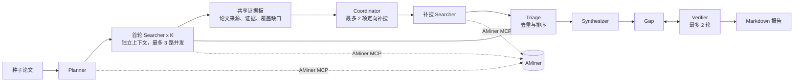

# Paper Scout

从 1-2 篇种子论文出发，生成一份可回看中间证据的文献调研报告。

Paper Scout 面向“我需要快速进入一个研究方向，但不想把检索、筛选、归纳和找研究缺口混在一次模型调用里”的场景。它使用 DeepSeek Harness 运行多个角色，通过 AMiner MCP 获取论文元数据和摘要，输出必读清单、领域综述与待验证的研究方向。

项目重点不在于堆叠 Agent 数量，而是让检索协作产生可观察的决策：首轮 Searcher 独立探索，结果汇总为共享证据板；Coordinator 根据重叠和覆盖缺口，只派发少量定向补搜任务。

## 输出

一次完整运行会生成：

- 按被引档位、新近度和是否读取摘要排序的论文清单；
- 按技术路线组织的中文领域综述；
- 以具体论文为依据的候选研究缺口，经过生成、核验和回改；
- 可检查的计划、语料、共享证据板、补搜决策和成本记录。

最终报告输出到 `reports/report-<timestamp>.md`。中间产物保留在 `reports/`，用于追溯“为什么补搜”“哪位 Searcher 发现了哪篇论文”和“结论来自摘要还是搜索结果”。

## 为什么需要多 Agent

文献调研是开放任务：开始时不知道有哪些子方向，也不知道哪一条检索线会遗漏关键工作。让一个 Agent 在一个上下文内完成所有工作，常见问题是检索角度被最早的结果锚定，或重复阅读同一批论文。

Paper Scout 使用固定的两轮协作协议：

1. **独立探索**：Planner 将领域拆为 2-6 个子方向，为每个方向定义覆盖范围和排除范围。首轮 Searcher 保持独立上下文，以不同检索词探索。
2. **共享证据**：Python 将首轮结果按论文 ID 合并。每篇论文保留发现它的 Agent、子方向、摘要级证据和来源类型；每个子方向保留已覆盖结论与未解问题。
3. **定向补搜**：Coordinator 只读取压缩后的证据板，不读取完整对话，也不调用工具。它最多派发 2 个补搜任务，明确补什么证据、用哪些检索词，并传递可复用的已精读论文 ID。
4. **综合与核验**：合并所有语料后，Synthesizer 写综述；Gap 和 Verifier 在最多两轮内生成、批评和收窄候选研究方向。

这使一个 Agent 的发现能改变后续任务，同时通过并发上限、详情读取上限和固定轮次约束成本。

## 架构



### 角色与边界

| 模块 | LLM 的职责 | 代码承担的约束 |
|---|---|---|
| Planner | 定位种子论文，划分子方向和检索边界 | 子方向数量限制为 2-6 |
| Searcher | 决定检索词的具体使用方式，筛选和总结论文 | 每个方向最多 8 篇候选、4 篇摘要精读 |
| 共享证据板 | 无 | 按 ID 去重，保留多 Agent 的独立观察与证据来源 |
| Coordinator | 判断重叠、覆盖缺口和补搜角度 | 最多 2 个任务，每个最多 3 个检索词 |
| 补搜 Searcher | 为指定缺口寻找正反证据 | 每项最多精读 2 篇，复用已有详情 |
| Triage | 无 | 确定性排序，影响力优先，新近度和精读状态为辅 |
| Gap / Verifier | 提出、批评并收窄研究方向 | 最多两轮；`keep`、`weak`、`drop` 结构化输出 |

模型的决策集中在任务拆分、检索策略、证据归纳和缺口判断；并发、预算、缓存有效性、去重、排序和终止条件由 Python 控制。

## 证据与成本

Searcher 会优先使用 `search_paper` 获取论文候选，只对最重要的候选调用 `get_paper_detail` 阅读摘要。补搜任务会带上首轮已精读论文的 ID，避免重复读取同一摘要。

每次端到端运行都会统计 AMiner 工具调用与模型输入/输出 token。下列文件构成一次运行的协作轨迹：

| 文件 | 内容 |
|---|---|
| `plan.json` | 种子论文、子方向、`scope`、`exclude` 和检索词 |
| `corpus_<i>.json` | 首轮某一子方向的论文笔记与覆盖结论 |
| `evidence_board.json` | 合并后的论文来源、证据和覆盖信息 |
| `followups.json` | Coordinator 的补搜理由、范围、检索词和复用论文 |
| `followup_corpus_<i>.json` | 定向补搜得到的语料 |
| `report-<timestamp>.md` | 必读清单、综述、候选研究方向和成本小结 |

缓存只在子方向名称、覆盖范围、排除范围和检索词完全一致时复用；这些字段变化后会自动重新检索，避免 Coordinator 根据过期语料做调度。

一次以工业缺陷/异常图像生成为主题的真实运行中，Coordinator 从首轮语料派发了“合成异常质量评估的反证”和“one-shot 条件下的生成式异常”两项补搜，最终汇总 36 篇论文。该次完整运行共调用 AMiner 71 次。这个数字是一次实例，不代表稳定基准；调用量取决于 Planner 的拆分、Coordinator 的决策和数据源响应。

## 快速开始

### 前置条件

- Python 3.10+；
- [DeepSeek Harness](https://github.com/deepseek-ai/deepseek-harness) 源码仓库，完成 `pnpm install && pnpm run build`；
- DeepSeek API Key；
- [AMiner](https://open.aminer.cn) Token。

### 安装

```bash
git clone https://github.com/<your-account>/paper-scout.git
cd paper-scout
python -m venv .venv
. .venv/bin/activate
pip install deepseek-harness-sdk json-repair
```

### 配置

在项目根目录创建 `.env`：

```bash
AMINER_TOKEN=your_aminer_token
DEEPSEEK_API_KEY=your_deepseek_api_key
```

将以下本机路径改为你的 DeepSeek Harness 检出目录：

- `dsh-src.sh` 中的 `apps/cli/src/bin.ts`；
- `paperscout/harness.py` 中的 `REPO`。

AMiner MCP 的配置位于 [`patches/aminer.patch.yml`](patches/aminer.patch.yml)。

### 运行

先用种子论文生成计划：

```bash
python run_planner.py \
  "Training-Free Industrial Defect Generation with Diffusion Models" \
  "AnomalyDiffusion: Few-Shot Anomaly Image Generation with Diffusion Model"
```

再执行完整流程：

```bash
python run_pipeline.py
```

调试单个首轮 Searcher：

```bash
python run_searcher.py 0
```

## 测试

以下测试不调用模型、AMiner 或网络，验证共享证据板、多 Agent 观察保留、补搜任务上限、已有详情复用和缓存失效规则：

```bash
python -m unittest -v test_collaboration.py
```

## 项目结构

```text
paper-scout/
├── paperscout/
│   ├── harness.py       dsh 配置、Agent 调用、JSON 解析和成本统计
│   ├── planner.py       种子论文到子方向计划
│   ├── searcher.py      检索、摘要精读和结构化论文笔记
│   ├── corpus.py        去重、共享证据板、排序和紧凑渲染
│   ├── coordinator.py   共享证据板到定向补搜任务
│   ├── synthesizer.py   领域综述生成
│   ├── gap.py           Gap、Verifier 与反思闭环
│   └── report.py        Markdown 报告组装
├── run_planner.py       生成 `plan.json`
├── run_searcher.py      调试一个 Searcher
├── run_pipeline.py      端到端编排入口
├── patches/             AMiner MCP 挂载配置
└── test_collaboration.py
```

## 局限

- 证据来自 AMiner 返回的论文元数据与摘要，不读取 PDF 全文；报告中的研究方向应理解为待验证候选，而非对领域新颖性的证明。
- Coordinator 的价值尚未在固定 gold set 上完成定量评测。下一步需要以相同模型和工具预算，对比静态分工与自适应补搜的论文召回、子方向覆盖率、重复详情读取率、耗时和成本。
- 数据源和模型输出均会影响检索结果。系统记录证据来源和运行轨迹，但不保证数据源覆盖完整或模型判断无误。
- 运行依赖本地 DeepSeek Harness 源码路径，尚未打包为可安装的独立命令行工具。

## 致谢

- [DeepSeek Harness](https://github.com/deepseek-ai/deepseek-harness)：Agent runtime 与 MCP 客户端。
- [AMiner](https://open.aminer.cn)：学术论文数据与 MCP 服务。
