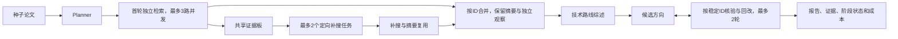

# Paper Scout

从 1–2 篇种子论文出发，通过 AMiner 检索与多角色协作生成中文文献调研报告。报告先推荐 5 篇阅读起点，再给出技术路线综述、候选研究方向和验证计划。

证据范围是论文元数据与摘要，不读取 PDF 全文。候选方向是待验证问题，不能作为领域新颖性的证明。

## 工作流程



首轮检索在独立上下文中探索不同方向。Coordinator 只看共享证据板，把首轮缺少的证据变成少量补搜任务。最终按论文 ID 合并，以更完整的摘要证据升级标题笔记，同时保留各方向的独立观察。

| 角色 | 代码约束 |
|---|---|
| Planner | 1–2 个种子、2–6 个子方向，每方向最多 4 个查询 |
| 首轮 Searcher | 每方向保留最多 8 篇，搜索调用不超过查询数，详情调用最多 4 次 |
| Coordinator | 不挂载 AMiner，最多 2 个任务，每任务最多 3 个查询 |
| 补搜 Searcher | 每任务最多 2 次详情调用，禁止重复读取提供的已有摘要 ID |
| 综述 / Gap / Verifier | 不挂载 AMiner；Verifier 必须按候选 ID 返回核验，遗漏、重复或无效结果标为未核验 |

`runtime/budget.mjs` 在 Harness 的 `tools/pre-execute` 中拦截超额、重复和非授权工具调用。并发调用也必须预留额度；预算插件未成功加载时，Python 拒绝发起模型请求。工具调用失败仍占用已准入额度，不自动重试。

模型输出在边界检查类型和结构。论文 ID 和标题必须匹配实际工具返回，才能进入语料；年份、被引档位与摘要读取状态由返回记录确定。方法与局限的归纳仍来自模型，报告会区分证据与推断。

## 安装与配置

需要 Python 3.10+、Node.js 22+、pnpm，以及已按官方说明安装构建的 [DeepSeek Harness 源码](https://github.com/deepseek-ai/deepseek-harness)。本项目仍依赖 Harness 源码运行时，不是独立分发的 CLI 包。

```bash
python3 -m venv .venv
. .venv/bin/activate
pip install -r requirements.txt
cp .env.example .env
```

在 `.env` 中填写：

```dotenv
DEEPSEEK_API_KEY=your_deepseek_api_key
AMINER_TOKEN=your_aminer_token
DEEPSEEK_HARNESS_REPO=/absolute/path/to/deepseek-harness
```

环境变量优先于 `.env`，无需修改 Python 或 shell 源码。`config/sdk/` 保存可复现的 profile 模板，首次运行时复制到本机 `dsh-home/`。AMiner 连接配置在 `patches/aminer.patch.yml`。

## 运行

以下命令会调用付费模型与 AMiner：

```bash
python run_planner.py \
  "Training-Free Industrial Defect Generation with Diffusion Models" \
  "AnomalyDiffusion: Few-Shot Anomaly Image Generation with Diffusion Model"
python run_pipeline.py --plan reports/plan.json
```

终端会打印 `runs/<run-id>/report.md`。每次新运行使用独立目录，不自动导入旧版 `reports/corpus_*.json`，避免跨计划混用证据。

```bash
# 从失败阶段恢复；成功阶段不重复产生费用
python run_pipeline.py --resume runs/<run-id>
# 单方向调试，独立保存在 runs/standalone/
python run_searcher.py 0 --plan reports/plan.json
```

恢复时校验冻结计划和代码指纹。代码或提示词变化后应新建运行。首轮证据补齐后，下游调度、补搜、综述和核验失效重跑；补搜补齐后综述与核验重跑。失败尝试的已知成本计入累计，连接异常造成的未知成本单独列出。

检索或 Coordinator 部分失败时可交付标有 `partial` 的报告；没有论文、综述失败或候选生成失败时记录 `failed`，不会把空结果宣布为成功。核验缺失不会默认通过。

## 运行产物

| 路径 | 用途 |
|---|---|
| `plan.json` / `manifest.json` | 冻结计划、阶段状态、失败原因、代码指纹、成本 |
| `corpus_<i>.json` | 首轮子方向结果 |
| `evidence_board.json` / `followups.json` | 首轮覆盖与补搜决策 |
| `followup_corpus_<i>.json` | 补搜结果 |
| `corpus.json` / `final_evidence_board.json` | 最终语料、独立观察及来源 |
| `synthesis.json` / `gaps.json` | 综述与逐轮候选、核验结果 |
| `agents/<session_id>.json` | 原始输出、事件、准入调用、token 及结束状态 |
| `report.md` | 优先阅读、综述、候选方向、完整清单、完成度 |

`corpus.json` 中每篇的 `provenance` 包含 session、tool_call_id、结果事件序号和原始论文记录；可据此核对 ID 与标题。此关联证明检索来源，不自动证明模型归纳的每句话正确。

成本按本运行内所有尝试累计；外部计划的生成费用不含在 pipeline 成本中。AMiner 数字是运行时准入调用数，实际计费以服务账单为准。模型输入拆分为未缓存输入与缓存读取，避免混淆。

## 示例与测试

[固定报告示例](examples/report.md) 是离线生成的格式示例，并非新的真实调研结果。示例生成器、输入和报告共同纳入版本管理。

以下检查无需 API Key、模型调用或 AMiner 网络连接：

```bash
python -m unittest discover -v
node --test tests/budget.test.mjs
python -m examples.generate
```

覆盖核验缺失、证据升级、真实被引档位、结构边界、来源校验、成本记录、阶段恢复和并发预算约束。CI 在 Python 3.10 / 3.13 上运行离线检查。

## 评测

离线审计一个新版运行：

```bash
python -m experiments.audit_traceability runs/<run-id>
```

新增对照实验会产生 API 费用，请显式运行：

```bash
# 同一首轮语料：预先确定的静态补搜 vs Coordinator 补搜
python -m experiments.compare_budget --source-run runs/<run-id>
# 对照组凭记忆列论文，再逐篇检索核对
python -m experiments.exp2_hallucination \
  --source-run runs/<run-id> --output-dir runs/memory-comparison
```

静态与自适应组匹配补搜搜索/详情调用额度、模型与每任务输出上限，Coordinator 费用单列。实际 token 和耗时仍需记录，不声称完全相同；可用 `--gold path.json` 提供人工相关论文 ID 列表来计算召回率。没有 gold set 时只报告新增论文数，召回率为 null。

[历史实验记录](experiments/RESULTS.md) 保留了原始观察并标注口径修订：旧版 31/31 可追溯是预设值，不能算作逐篇验证；追加预算后论文增多，不能单独证明自适应调度优于同预算静态补搜。新版付费对照尚未执行。

## 局限

- 检索范围取决于 AMiner 覆盖，搜索未命中不等于论文不存在。
- 只读摘要；具体实验数值、方法细节和新颖性应进一步查全文。
- 核验与归纳仍由模型完成，未做人工 gold set 上的多主题、多次重复评测。
- 已实现阶段恢复，但 Gap 内部两轮作为一个恢复单元，失败后会重跑该阶段。
- 本机运行目录与会话不进 Git；历史已提交内容不会因忽略规则而从 Git 历史中消失。
