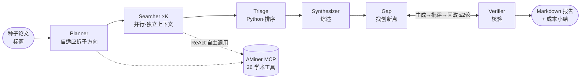

# Paper Scout 🧭

> 多 Agent 论文调研助手：给 1–2 篇**种子论文**，自动产出一份引用可追溯的调研报告——**必读清单 + 领域综述 + 创新点/研究空白**。
>
> A multi-agent literature-scouting assistant built on **DeepSeek Harness (dsh)** × **AMiner MCP**.

面向研究生"读论文、找创新点"的真实场景：单个 agent 做综述往往**漏**（广度不够）、**浅**（不深挖）、**不主动找 gap**。Paper Scout 把这件事拆给五个专职 agent 分工协作——规划、并行检索精读、综述、创新点发掘、核验——用多智能体换来广度、上下文隔离与批判性。

---

## 效果

给定两篇种子论文（示例方向：*工业缺陷/异常图像生成*），一条命令产出一份 Markdown 报告，含三段：

1. **必读清单**：跨子方向去重、按 被引档位 × 新近度 × 是否精读 排序，每篇附"为什么读"。
2. **领域综述**：按方法流派分类，给出共识、分歧、技术演变时间线。
3. **创新点 / 研究空白**：每条 grounded 到具体论文（现状证据 + 缺口），并经核验闭环剔除"假新颖"。

样例报告见 [`reports/`](reports/)。

---

## 架构

三层：**Python 编排层**（导演）· **dsh agent 推理层**（大脑）· **AMiner MCP 数据层**（论文库）。



- **Planner**：定位种子（`search_paper_by_title` → `get_paper_detail`），**按领域宽窄自适应决定拆几个子方向**（2–6，带取舍理由）。
- **Searcher ×K**：每个子方向一个 agent，**并行、各自独立上下文**，以 ReAct 自主 `search_paper` → 精读摘要 → 沿 `get_paper_citations` / `recommend_paper` 扩展。
- **Triage**：纯 Python 确定性排序，产出必读清单。
- **Synthesizer**：把语料综合成结构化综述。
- **Gap ⇄ Verifier**：**Reflection 闭环**——Gap 生成候选，Verifier 严格判 `keep/weak/drop`，把不过关的连同理由打回 Gap 收窄重出，最多 2 轮。

---

## 核心设计

| 设计 | 说明 |
|---|---|
| **Python 自建多 Agent 编排** | Orchestrator-Worker + Pipeline；每个角色一次隔离的 `harness.run`，编排顺序、并行、成本纪律都在代码里可控。 |
| **MCP 自主 tool-use** | 通过 MCP 把 AMiner 26 个学术工具挂成 agent 原生能力，检索策略由 agent 自主决策，而非写死。 |
| **Reflection 闭环** | 生成→批评→回改重出→再批评；每条创新点强制落到具体论文，抑制大模型"假新颖"。 |
| **代码编排 vs subagent 委派** | 流程已知固定 → 选代码编排换取确定性、成本可控、中间结果可缓存；开放式任务才该用 agent 自主委派。 |
| **成本可观测** | 从会话事件流统计每次运行的 AMiner 调用次数与 token；广度走限免接口、只对入选 top-N 调用计费的全文接口。 |
| **LLM-JSON 健壮性** | prompt 约束 + `json-repair` 兜底 + 列表归一，三重保险让结构化产出稳定。 |

---

## 快速开始

### 前置

- **dsh 源码仓库**（提供 agent runtime）：[deepseek-harness](https://github.com/deepseek-ai/deepseek-harness)，`pnpm install && pnpm run build`（需 Node ^22.19 || >=24、pnpm）。
- **Python** 3.10+
- **DeepSeek API key**（agent 的模型）+ **AMiner Token**（数据源，[open.aminer.cn](https://open.aminer.cn) 申请）。

### 安装

```bash
git clone https://github.com/<你的用户名>/paper-scout.git
cd paper-scout
python -m venv .venv && . .venv/bin/activate
pip install deepseek-harness-sdk json-repair
```

### 配置

1. **密钥**：在项目根建 `.env`（已被 gitignore）：
   ```
   AMINER_TOKEN=你的 AMiner token
   DEEPSEEK_API_KEY=sk-你的 DeepSeek key
   ```
2. **dsh 仓库路径**：改两处指向你本地的 dsh 检出：
   - `dsh-src.sh` 里 `bin.ts` 的绝对路径；
   - `paperscout/harness.py` 顶部的 `REPO`。
   > AMiner MCP 的挂载配置见 [`patches/aminer.patch.yml`](patches/aminer.patch.yml)，无需改动。

### 运行

```bash
# 1) 规划：种子论文 → 自适应拆子方向（结果存 reports/plan.json）
python run_planner.py "Training-Free Industrial Defect Generation with Diffusion Models" \
                      "AnomalyDiffusion: Few-Shot Anomaly Image Generation with Diffusion Model"

# 2) 全流程：检索 → 综述 → 创新点 → 核验 → 报告（存 reports/report-<时间戳>.md）
python run_pipeline.py
```

> `run_pipeline.py` 会复用 `reports/corpus_*.json` 缓存；想全新跑就先删掉它们。
> 单独调试某个子方向：`python run_searcher.py <序号>`。

---

## 项目结构

```
paper-scout/
├── paperscout/
│   ├── harness.py       dsh 启动配置 + agent 调用 + 成本记账 + JSON 解析
│   ├── planner.py       M1 规划：种子 → 自适应子方向
│   ├── searcher.py      M2 检索：一个子方向 → 结构化语料
│   ├── corpus.py        M3 合并/去重/排序（Triage）
│   ├── synthesizer.py   M4 综述
│   ├── gap.py           M5 Gap + Verifier + Reflection 闭环
│   └── report.py        M6 报告组装
├── run_planner.py       入口：规划
├── run_searcher.py      入口：单子方向检索
├── run_pipeline.py      入口：端到端
├── patches/aminer.patch.yml   把 AMiner MCP 挂进 dsh 的补丁
├── dsh-src.sh           用源码 dsh 启动（经 tsx）
└── reports/             产物：plan.json / corpus_*.json / report-*.md
```

---

## 成本

每次运行报告末尾会给出 AMiner 调用次数与 token 用量。省钱手法：广度检索走**限免**接口 + 批量部分摘要，只对入选 top-N 论文调用**计费**的 `get_paper_detail`（每个子方向精读上限默认 4 篇）。

## 局限与路线图

- **数据源仅 AMiner**：只有**向后参考文献**（无"谁引用了它"）、只有摘要非全文。
- **子方向串行**执行（并行是明确的优化项）；Searcher 的广度检索存在一定冗余。
- 语料缓存按序号存，改 plan 后需清缓存。
- **路线图**：PDF 种子输入（读全文增强规划）· 跨运行论文记忆库 · 并行 Searcher · 召回率评测集 · 缓存按内容 hash。

## 致谢

- [DeepSeek Harness (dsh)](https://github.com/deepseek-ai/deepseek-harness) —— 一切皆插件的开源 agent 框架，提供 runtime 与 MCP 客户端。
- [AMiner](https://open.aminer.cn) —— 学术数据与 MCP 服务。
